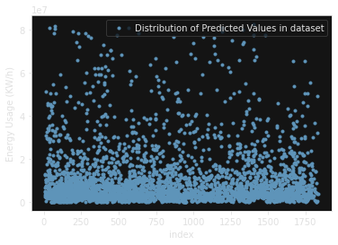
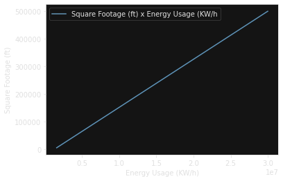
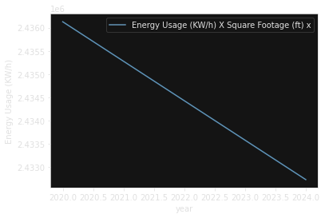

# Final Project
Group: 21

### Introduction:
#### Why was the project undertaken?
We wanted to estimate a value related to the environment, from a dataset from boston.gov

#### What was the research question, the tested hypothesis or the purpose of the research?

We were wondering what characteristics will make the best prediction from a dataset with many features.

#### What is the source of the dataset? Characteristics of data?
4 years of records for buildings in Boston. Includes 64 different property types, where we only used the top 10. Also used to 97% quantile for outliers in the total energy usage (what we are predicting)

[link to data](data.boston.gov/dataset/building-energy-reporting-and-disclosure-ordinance)

|    | Property Name        | Reported   |   Property Type | Address           |   ZIP |   Gross Area (sq ft) |   Energy Star Certified | Property Uses             |   Year Built |   GHG Emissions (MTCO2e) |   GHG Intensity (kgCO2/sf) |   Total Site Energy (kBTU) |   % Electricity |    % Gas |   % Steam |   Water Intensity (gal/sf) |   User Submitted Info |   User Submitted Link |   Tax Parcel |   Year |
|---:|:---------------------|:-----------|----------------:|:------------------|------:|---------------------:|------------------------:|:--------------------------|-------------:|-------------------------:|---------------------------:|---------------------------:|----------------:|---------:|----------:|---------------------------:|----------------------:|----------------------:|-------------:|-------:|
|  0 | #2665 - West Roxbury | Compliant  |               0 | 1213 VFW Parkway  | 02132 |               123596 |                       0 | Retail Store              |         1994 |                    696.5 |                        5.6 |                1.07333e+07 |        0.497101 | 0.460182 |       nan |                       5.52 |                   nan |                   nan |   2009216400 |   2018 |
|  1 | #2679 - South Bay    | Compliant  |               0 | 5 Allstate Road   | 02125 |               130520 |                       0 | Retail Store              |         1998 |                    590.3 |                        4.5 |                9.08599e+06 |        0.49998  | 0.457056 |       nan |                       5.99 |                   nan |                   nan |   0703501080 |   2018 |
|  2 | 00602-prudential     | Compliant  |               1 | 53 Huntington Ave | 02199 |                42918 |                       0 | Supermarket/Grocery Store |         2003 |                   1019.8 |                       17.1 |                1.49937e+07 |        0.628841 | 0.317121 |       nan |                       0    |                   nan |                   nan |   0401037400 |   2018 |

#### Any munging, imputation, or feature engineering?
For the property type, data transformation was required. Mapping each unique prop type to a number, and replacing it with the mapped number.  StandardScaller from scikit-learn was used for feature scaling, as well as linear_model (ElasticNetCV, LassoCV, RidgeCV)

The property types we can predict energy amount on are

`{'Office': 4, 'Other - Education': 5, 'Residence Hall/Dormitory': 7, 'Multifamily Housing': 8, 'Other': 10}`

Total Site Energy (kBTU) | Property Type | Gross Area (sq ft) | Year Built
:-----:|:-----:|:-----:|:-----:
3387295.9 | 4| 44464.0| 1899.0                                              
4658417.7 | 4| 44000.0| 1878.0                                              
2469891.3 | 5| 69739.0| 2004.0                                              
2099052.8 | 4| 38000.0| 1900.0                                              
30925692.5| 4| 61168.0| 1920.0    

This shows that after the 97% split, the predicted values fall mostly under 20000000, to 80000000

### Methods
#### What materials/APIs/tools were used or who was included in answering the research question?
Scikit Learn, NumPy, Pandas, os, StandardScaler, linear_model (ElasticNetCV, LassoCV, RidgeCV), and cross_validation

### Results
#### What answer was found to the research question; what did the study find? Was the tested hypothesis true? Any visualizations?
It is possible to use regression to predict energy output with some accuracy (0.7 r^2, with LOO CV)
 

  
   

This shows that with a linear increase in sq_footage, the predicted energy usage increases

### Discussion
#### What might the answer imply and why does it matter? How does it fit in with what other researchers have found? What are the perspectives for future research? Survey about the tools investigated for this assignment.

The model can be used to judge if a property is above or below the Boston energy usage average, for 10 property types.

### Summary

It is possible to fit a regression model to predict with some accuracy how much energy a building in Boston will use.
#### Most important findings.

More than 10 property types decrease performance (less training samples?)

